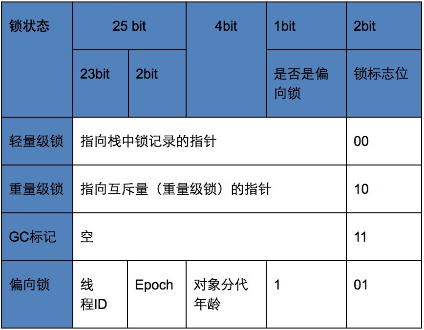

# [偏向锁，轻量级锁，自旋锁，重量级锁的详细介绍](https://www.cnblogs.com/wade-luffy/p/5969418.html)

**目录**

- [Java对象头](https://www.cnblogs.com/wade-luffy/p/5969418.html#_label0)
- 几种锁的类型
  - [偏向锁](https://www.cnblogs.com/wade-luffy/p/5969418.html#_label1_0)
  - [自旋锁](https://www.cnblogs.com/wade-luffy/p/5969418.html#_label1_1)
  - [轻量级锁](https://www.cnblogs.com/wade-luffy/p/5969418.html#_label1_2)
  - [重量级锁](https://www.cnblogs.com/wade-luffy/p/5969418.html#_label1_3)
- [锁的优缺点对比](https://www.cnblogs.com/wade-luffy/p/5969418.html#_label2)

 

------

何为同步？JVM规范规定JVM基于进入和退出Monitor对象来实现方法同步和代码块同步，但两者的实现细节不一样。代码块同步是使用monitorenter和monitorexit指令实现，而方法同步是使用另外一种方式实现的，细节在JVM规范里并没有详细说明，但是方法的同步同样可以使用这两个指令来实现。monitorenter指令是在编译后插入到同步代码块的开始位置，而monitorexit是插入到方法结束处和异常处， JVM要保证每个monitorenter必须有对应的monitorexit与之配对。任何对象都有一个 monitor 与之关联，当且一个monitor 被持有后，它将处于锁定状态。线程执行到 monitorenter 指令时，将会尝试获取对象所对应的 monitor 的所有权，即尝试获得对象的锁。

[回到顶部](https://www.cnblogs.com/wade-luffy/p/5969418.html#_labelTop)

## Java对象头

锁存在Java对象头里。如果对象是数组类型，则虚拟机用3个Word（字宽）存储对象头，如果对象是非数组类型，则用2字宽存储对象头。在32位虚拟机中，一字宽等于四字节，即32bit。

| 长度     | 内容                   | 说明                             |
| -------- | ---------------------- | -------------------------------- |
| 32/64bit | Mark Word              | 存储对象的hashCode或锁信息等     |
| 32/64bit | Class Metadata Address | 存储到对象类型数据的指针         |
| 32/64bit | Array length           | 数组的长度（如果当前对象是数组） |

Java对象头里的Mark Word里默认存储对象的HashCode，分代年龄和锁标记位。32位JVM的Mark Word的默认存储结构如下：

|          | 25 bit         | 4bit         | 1bit 是否是偏向锁 | 2bit 锁标志位 |
| -------- | -------------- | ------------ | ----------------- | ------------- |
| 无锁状态 | 对象的hashCode | 对象分代年龄 | 0                 | 01            |

在运行期间Mark Word里存储的数据会随着锁标志位的变化而变化。Mark Word可能变化为存储以下4种数据：

[回到顶部](https://www.cnblogs.com/wade-luffy/p/5969418.html#_labelTop)

## 几种锁的类型

**线程的阻塞和唤醒需要CPU从用户态转为核心态，频繁的阻塞和唤醒对CPU来说是一件负担很重的工作。**

Java SE1.6为了减少获得锁和释放锁所带来的性能消耗，引入了“偏向锁”和“轻量级锁”，所以在Java SE1.6里锁一共有四种状态，无锁状态，偏向锁状态，轻量级锁状态和重量级锁状态，它会随着竞争情况逐渐升级。**锁可以升级但不能降级，意味着偏向锁升级成轻量级锁后不能降级成偏向锁。这种锁升级却不能降级的策略，目的是为了提高获得锁和释放锁的效率。**

### 偏向锁

大多数情况下锁不仅不存在多线程竞争，而且总是由同一线程多次获得。偏向锁的目的是在某个线程获得锁之后，消除这个线程锁重入（CAS）的开销，看起来让这个线程得到了偏护。另外，JVM对那种会有多线程加锁，但不存在锁竞争的情况也做了优化，听起来比较拗口，但在现实应用中确实是可能出现这种情况，因为线程之前除了互斥之外也可能发生同步关系，被同步的两个线程（一前一后）对共享对象锁的竞争很可能是没有冲突的。对这种情况，JVM用一个epoch表示一个偏向锁的时间戳（真实地生成一个时间戳代价还是蛮大的，因此这里应当理解为一种类似时间戳的identifier）

偏向锁的获取

当一个线程访问同步块并获取锁时，会在对象头和栈帧中的锁记录里存储锁偏向的线程ID，以后该线程在进入和退出同步块时不需要花费CAS操作来加锁和解锁，而只需简单的测试一下对象头的Mark Word里是否存储着指向当前线程的偏向锁，如果测试成功，表示线程已经获得了锁，如果测试失败，则需要再测试下Mark Word中偏向锁的标识是否设置成1（表示当前是偏向锁），如果没有设置，则使用CAS竞争锁，如果设置了，则尝试使用CAS将对象头的偏向锁指向当前线程。

偏向锁的撤销

偏向锁使用了一种等到竞争出现才释放锁的机制，所以当其他线程尝试竞争偏向锁时，持有偏向锁的线程才会释放锁。偏向锁的撤销，需要等待全局安全点（在这个时间点上没有字节码正在执行），它会首先暂停拥有偏向锁的线程，然后检查持有偏向锁的线程是否活着，如果线程不处于活动状态，则将对象头设置成无锁状态，如果线程仍然活着，拥有偏向锁的栈会被执行，遍历偏向对象的锁记录，栈中的锁记录和对象头的Mark Word，要么重新偏向于其他线程，要么恢复到无锁或者标记对象不适合作为偏向锁，最后唤醒暂停的线程。

偏向锁的设置

关闭偏向锁：偏向锁在Java 6和Java 7里是默认启用的，但是它在应用程序启动几秒钟之后才激活，如有必要可以使用JVM参数来关闭延迟-XX：BiasedLockingStartupDelay = 0。如果你确定自己应用程序里所有的锁通常情况下处于竞争状态，可以通过JVM参数关闭偏向锁-XX:-UseBiasedLocking=false，那么默认会进入轻量级锁状态。

### 自旋锁

线程的阻塞和唤醒需要CPU从用户态转为核心态，频繁的阻塞和唤醒对CPU来说是一件负担很重的工作。同时我们可以发现，很多对象锁的锁定状态只会持续很短的一段时间，例如整数的自加操作，在很短的时间内阻塞并唤醒线程显然不值得，为此引入了自旋锁。

所谓“自旋”，就是让线程去执行一个无意义的循环，循环结束后再去重新竞争锁，如果竞争不到继续循环，循环过程中线程会一直处于running状态，但是基于JVM的线程调度，会出让时间片，所以其他线程依旧有申请锁和释放锁的机会。

自旋锁省去了阻塞锁的时间空间（队列的维护等）开销，但是长时间自旋就变成了“忙式等待”，忙式等待显然还不如阻塞锁。所以自旋的次数一般控制在一个范围内，例如10,100等，在超出这个范围后，自旋锁会升级为阻塞锁。

### 轻量级锁

加锁

线程在执行同步块之前，JVM会先在当前线程的栈桢中创建用于存储锁记录的空间，并将对象头中的Mark Word复制到锁记录中，官方称为Displaced Mark Word。**然后线程尝试使用CAS将对象头中的Mark Word替换为指向锁记录的指针。如果成功，当前线程获得锁，如果失败，则自旋获取锁，当自旋获取锁仍然失败时，表示存在其他线程竞争锁(两条或两条以上的线程竞争同一个锁)，则轻量级锁会膨胀成重量级锁。**

解锁

**轻量级解锁时，会使用原子的CAS操作来将Displaced Mark Word替换回到对象头，如果成功，则表示同步过程已完成。**如果失败，表示有其他线程尝试过获取该锁，则要在释放锁的同时唤醒被挂起的线程。

### 重量级锁

重量锁在JVM中又叫对象监视器（Monitor），它很像C中的Mutex，除了具备Mutex(0|1)互斥的功能，它还负责实现了Semaphore(信号量)的功能，也就是说它至少包含一个竞争锁的队列，和一个信号阻塞队列（wait队列），前者负责做互斥，后一个用于做线程同步。

[回到顶部](https://www.cnblogs.com/wade-luffy/p/5969418.html#_labelTop)

## 锁的优缺点对比

| 锁       | 优点                                                         | 缺点                                           | 适用场景                         |
| -------- | ------------------------------------------------------------ | ---------------------------------------------- | -------------------------------- |
| 偏向锁   | 加锁和解锁不需要额外的消耗，和执行非同步方法比仅存在纳秒级的差距 | 如果线程间存在锁竞争，会带来额外的锁撤销的消耗 | 适用于只有一个线程访问同步块场景 |
| 轻量级锁 | 竞争的线程不会阻塞，提高了程序的响应速度                     | 如果始终得不到锁竞争的线程使用自旋会消耗CPU    | 追求响应时间,锁占用时间很短      |
| 重量级锁 | 线程竞争不使用自旋，不会消耗CPU                              | 线程阻塞，响应时间缓慢                         | 追求吞吐量,锁占用时间较长        |

分类: [JDK基础](https://www.cnblogs.com/wade-luffy/category/853135.html)